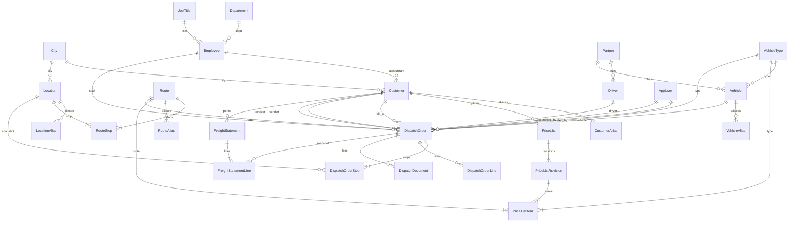
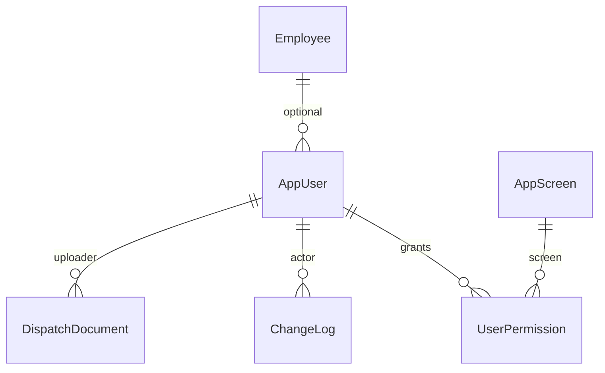
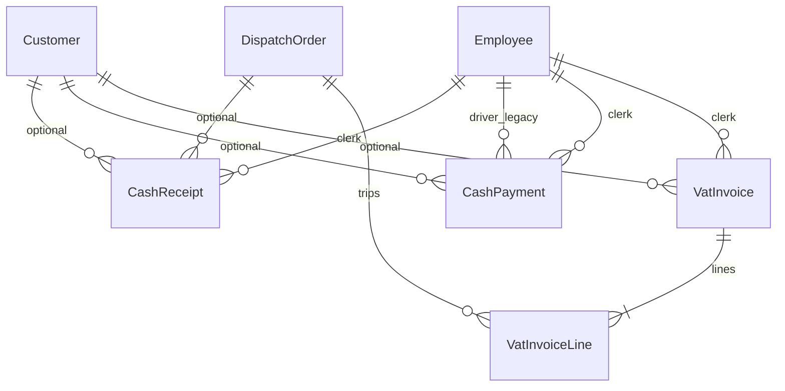

# Database — Hà Minh Anh (`Hma`)

Thiết kế vật lý của database **Hma** (SQL Server 2016+). Khớp với `database/001_schema.sql` và entity trong `Hma.Domain`. Mapping DHXE → Hma: [`schema-mapping.md`](schema-mapping.md). Cutover: [`etl-cutover.md`](etl-cutover.md). Kiến trúc ứng dụng: [`Architecture.md`](Architecture.md).

**Nguồn sự thật schema (code-first):** entity trong `Hma.Domain` + `HmaDbContext.OnModelCreating` + thư mục `src/Hma.Infrastructure.SqlServer/Migrations`. App gọi `MigrateAndSeedAsync` lúc start. [`database/001_schema.sql`](../database/001_schema.sql) giữ cho cutover/ETL — đổi cột thì cập nhật **cùng** migration EF.

---

## 1. Quyết định thiết kế

| Quyết định | Chi tiết |
|------------|----------|
| Engine | SQL Server 2016+ / LocalDB. Unicode `NVARCHAR`. Ngày `DATETIME2` (catalog ngày thuần: `DATE`). |
| Naming | Bảng/cột English PascalCase, **số ít**. PK `Id` `INT IDENTITY`. FK `{Table}Id`. |
| Schema | `dbo` only. Không schema theo module. |
| Tiền cước (Phase 1) | `DECIMAL(20,2)` — `PriceListItem`, `DispatchOrder`, `FreightStatement` / `Line`. |
| Tiền kế toán (đóng băng) | `DECIMAL(18,0)` — `CashReceipt`, `CashPayment`, `VatInvoice`. |
| Tải trọng | `DECIMAL(9,2)` — `VehicleType.Tonnage`, `Vehicle.Tonnage`. |
| Enum | `INT` trên bảng; giá trị C# trong mục 5. |
| ETL | Cột `LegacyId INT NULL` trên hầu hết bảng nghiệp vụ. **Không** dùng tên cũ (`nil`, `kh_ud`) làm identifier production. |
| File chứng từ | Metadata trong `DispatchDocument`; `StoredPath` là **relative storage key**. Bytes qua `IFileStorage` (Phase 1: đĩa local/share). |
| Optimistic concurrency | `ROWVERSION` trên `DispatchOrder`, `PriceList`, `FreightStatement`, `DocumentSequence`. |
| Không có | View, trigger, stored procedure nghiệp vụ, Plexis `ui_*`. Logic nằm ở Application. |
| Lazy loading | Tắt. Query `Include` + `Take`. |

`001_schema.sql` **DROP toàn bộ bảng** theo thứ tự phụ thuộc rồi tạo lại. Không phải migration tăng dần. Production/cutover: backup trước, chạy schema trên DB trống (hoặc chấp nhận mất data).

Dev app: `HmaDatabaseInitializer.MigrateAndSeedAsync` — `Database.Migrate`. DB cũ tạo bằng `EnsureCreated` (không có `__EFMigrationsHistory`) được bắt nhịp cột rồi ghi baseline `InitialCreate`, **không drop**. Production/cutover: migration EF hoặc `001_schema.sql` trên DB trống.

---

## 2. Nhóm bảng

| Nhóm | Bảng | Phase 1 |
|------|------|---------|
| Catalog | `City`, `Location`, `Route`, `RouteStop`, `LocationAlias`, `RouteAlias`, `CustomerAlias`, `VehicleAlias`, `Department`, `JobTitle`, `VehicleType`, `PaymentMethod`, `Employee`, `Partner`, `Driver`, `Vehicle`, `Customer` | Dùng (`PaymentMethod` chưa có màn) |
| Giá | `PriceList`, `PriceListRevision`, `PriceListItem` | Dùng |
| Lệnh | `DispatchOrder`, `DispatchOrderStop`, `DispatchOrderLine`, `DispatchDocument` | Dùng |
| Bảng kê | `FreightStatement`, `FreightStatementLine` | Dùng |
| Audit / hệ thống | `ChangeLog`, `DocumentSequence`, `SystemParameter`, `Company` | Dùng |
| Bảo mật | `AppScreen`, `AppUser`, `UserPermission` | Dùng |
| Kế toán (đóng băng) | `CashReceipt`, `CashPayment`, `VatInvoice`, `VatInvoiceLine` | Schema sẵn; không ETL, không nav |

---

## 3. Sơ đồ quan hệ

### 3.1 Catalog, giá, lệnh, bảng kê



### 3.2 Bảo mật và hệ thống



`Company`, `DocumentSequence`, `SystemParameter` không FK tới bảng khác.

### 3.3 Đóng băng (phase kế toán)



`CashPayment.DriverEmployeeId` trỏ `Employee` (legacy lái xe nằm trong `nhanvien`), **không** trỏ `Driver`.

---

## 4. Quy ước cột chung

Hầu hết bảng nghiệp vụ:

| Cột | Kiểu | Ý nghĩa |
|-----|------|---------|
| `Id` | `INT IDENTITY(1,1)` PK | Surrogate. ETL giữ Id cũ bằng `IDENTITY_INSERT`. |
| `LegacyId` | `INT NULL` | Id nguồn DHXE; không dùng làm FK production. |

Ngoại lệ **không** có `LegacyId` trong `001_schema.sql`: `VehicleType`, `PaymentMethod`, `AppScreen`, `UserPermission`, `ChangeLog`, `DocumentSequence`, `SystemParameter`, `Company`, `LocationAlias`, `RouteAlias`, `CustomerAlias`, `VehicleAlias`.

Entity C# kế thừa `Entity` vẫn có property `LegacyId`. `EnsureCreated` của EF có thể tạo cột này trên những bảng trên; script SQL thì không. **Production theo `001_schema.sql`.**

Cột `Key` / `Value` / `Year` / `Month` là reserved word SQL — luôn quote `[Key]`, `[Value]`, `[Year]`, `[Month]`.

---

## 5. Enum lưu `INT`

### `DispatchOrder.Status` — `DispatchStatus`

| Giá trị | Tên | Ý nghĩa |
|--------:|-----|---------|
| 0 | Draft | Nháp (ít dùng; lệnh mới là Issued) |
| 1 | Issued | Đã phát hành (default SQL `DF_DispatchOrder_Status`) |
| 2 | Completed | Hoàn thành chuyến — điều kiện đối soát / bảng kê |
| 3 | Locked | Khóa; chỉ quản lý sửa; không xóa |

### `DispatchOrder.ReconciliationStatus` — `ReconciliationStatus`

| Giá trị | Tên | Ý nghĩa |
|--------:|-----|---------|
| 0 | Pending | Chưa đối soát (default) |
| 1 | Reconciled | Đã đối soát |

### `DispatchDocument.Kind` — `DispatchDocumentKind`

| Giá trị | Tên | Ý nghĩa |
|--------:|-----|---------|
| 0 | DispatchOrder | File lệnh |
| 1 | DeliveryNote | Biên bản giao hàng — **bắt buộc** để đối soát và vào bảng kê |
| 2 | Invoice | Hóa đơn / chứng từ liên quan |
| 3 | Other | Khác |

### Đóng băng

`CashReceipt.Kind`: `0` Dispatch, `1` Customer.  
`CashPayment.Kind`: `1` Customer, `2` Driver.

### `LocationAlias.Kind` — `LocationAliasKind`

| Giá trị | Tên | Ý nghĩa |
|--------:|-----|---------|
| 0 | Both | Dùng cho cả điểm đi và điểm đến (mặc định) |
| 1 | Pickup | Chỉ điểm đi |
| 2 | Delivery | Chỉ điểm đến |

---

## 6. Catalog — cột

### `City`

| Cột | Kiểu | Null | Ghi chú |
|-----|------|------|---------|
| Id | INT IDENTITY | PK | |
| Code | NVARCHAR(50) | NOT NULL | `UQ_City_Code` |
| Name | NVARCHAR(255) | NOT NULL | |
| Description | NVARCHAR(500) | NULL | |
| LegacyId | INT | NULL | `thanhpho_id` |

### `Location`

Điểm lấy / giao / qua. `CityId` tùy chọn (địa chỉ hành chính), không dùng làm tuyến.

| Cột | Kiểu | Null | Ghi chú |
|-----|------|------|---------|
| Id | INT IDENTITY | PK | |
| Code | NVARCHAR(50) | NOT NULL unique | |
| Name | NVARCHAR(255) | NOT NULL | |
| Description | NVARCHAR(500) | NULL | |
| CityId | INT | NULL → City Restrict | |
| LegacyId | INT | NULL | |

### `Route` / `RouteStop`

Tuyến = ≥2 điểm có thứ tự. `Fingerprint` unique `"id1-id2-id3"`. `Name` ghép `A → B → C` lúc lưu.

### `LocationAlias`

Bí danh điểm (Excel) trỏ tới `Location`. Unique `Alias`. Kind: Both / Pickup / Delivery.

Index `IX_LocationAlias_Location`. Application chặn trùng khóa với `RouteAlias` và mã/tên Location/Route.

### `RouteAlias`

Bí danh tuyến: khóa khớp cả ô «Tuyến đường». Unique `Alias` → một `Route`.

### `CustomerAlias`

Bí danh khách (`TEC`, `KMG`) trỏ tới `Customer`. Không ETL.

| Cột | Kiểu | Null | Ghi chú |
|-----|------|------|---------|
| Id | INT IDENTITY | PK | |
| Alias | NVARCHAR(100) | NOT NULL | `UQ_CustomerAlias_Alias` |
| CustomerId | INT | NOT NULL | → `Customer` Restrict |

Index `IX_CustomerAlias_Customer`. Application chặn bí danh trùng `Customer.Code` / `Customer.Name`.

### `Department` / `JobTitle`

Cùng hình: `Id`, `Code` unique, `Name`, `LegacyId`. Nguồn `phongban` / `chucvu`.

### `VehicleType`

| Cột | Kiểu | Null | Ghi chú |
|-----|------|------|---------|
| Id | INT IDENTITY | PK | ETL **giữ Id** `loaixe` |
| Code | NVARCHAR(50) | NOT NULL | unique. Seed: `1.25T` … `15T` |
| Name | NVARCHAR(255) | NOT NULL | |
| Tonnage | DECIMAL(9,2) | NOT NULL | |

Seed 8 loại (Id 1–8 khi chạy `002_seed.sql` với `IDENTITY_INSERT`): 1.25, 3.5, 5, 1.45, 8, 2.5, 10, 15 tấn.

### `PaymentMethod`

`Id`, `Code` unique, `Name`. Chưa seed, chưa có màn Phase 1. `VatInvoice` dùng `PaymentMethodText` (chuỗi), không FK bảng này.

### `Employee`

| Cột | Kiểu | Null | Ghi chú |
|-----|------|------|---------|
| Id | INT IDENTITY | PK | ETL = `nhanvien_id` (cả NV văn phòng lẫn người có biển) |
| Code | NVARCHAR(50) | NOT NULL | `UQ_Employee_Code` |
| Name | NVARCHAR(255) | NOT NULL | |
| Address, Phone, Mobile | NVARCHAR | NULL | Phone 50 |
| BirthDate | DATE | NULL | |
| IdentityNumber | NVARCHAR(50) | NULL | CCCD/CMND |
| VehiclePlate | NVARCHAR(50) | NULL | Biển trên hồ sơ NV (legacy); xe vận hành nằm ở `Vehicle` |
| DepartmentId | INT | NULL | → `Department` |
| JobTitleId | INT | NULL | → `JobTitle` |
| UpdatedAt | DATETIME2 | NULL | |
| LegacyId | INT | NULL | |

### `Partner`

Đối tác cung cấp xe. **Bắt buộc** có dòng `Code = N'UNASSIGNED'`, `Name = N'Chưa gán đối tác'` (seed + ETL). Xe/TX migrate từ `nhanvien.biensoxe` gắn partner này rồi gán lại sau go-live.

| Cột | Kiểu | Null |
|-----|------|------|
| Id | INT IDENTITY | PK |
| Code | NVARCHAR(50) NOT NULL | `UQ_Partner_Code` |
| Name | NVARCHAR(255) NOT NULL | |
| TaxCode | NVARCHAR(50) | |
| Address | NVARCHAR(255) | |
| ContactName | NVARCHAR(255) | |
| Phone | NVARCHAR(50) | |
| Email | NVARCHAR(255) | |
| LegacyId | INT | |

### `Driver`

| Cột | Kiểu | Null | Ghi chú |
|-----|------|------|---------|
| Id | INT IDENTITY | PK | |
| Code | NVARCHAR(50) NOT NULL | `UQ_Driver_Code` | ETL từ `nhanvien_ud` |
| Name | NVARCHAR(255) NOT NULL | | |
| Phone | NVARCHAR(50) | | |
| BirthDate | DATE | | |
| IdentityNumber | NVARCHAR(50) | | |
| PartnerId | INT NOT NULL | → `Partner` | |
| LegacyId | INT | | `nhanvien_id` khi tách từ biển số |

### `Vehicle`

| Cột | Kiểu | Null | Ghi chú |
|-----|------|------|---------|
| Id | INT IDENTITY | PK | |
| PlateNumber | NVARCHAR(50) NOT NULL | `UQ_Vehicle_Plate` | |
| PartnerId | INT NOT NULL | → `Partner` | |
| VehicleTypeId | INT | → `VehicleType` | |
| Tonnage | DECIMAL(9,2) | | Có thể khác type |
| LegacyId | INT | | |

`PlateNumber` lưu dạng chuẩn `xxY-xxxx` hoặc `xxY-xxxxx` (ví dụ `29C-23456`). Khi thêm/sửa xe, app tự tạo bí danh không gạch (`29C23456`; `29c23456` khớp không phân biệt hoa/thường).

### `VehicleAlias`

Bí danh biển (file điều xe / import) trỏ tới `Vehicle`. Tự tạo khi lưu xe. Không ETL.

| Cột | Kiểu | Null | Ghi chú |
|-----|------|------|---------|
| Id | INT IDENTITY | PK | |
| Alias | NVARCHAR(100) | NOT NULL | `UQ_VehicleAlias_Alias` |
| VehicleId | INT | NOT NULL | → `Vehicle` Cascade |

Index `IX_VehicleAlias_Vehicle`. Import khớp biển thật hoặc bí danh.

### `Customer`

| Cột | Kiểu | Null | Ghi chú |
|-----|------|------|---------|
| Id | INT IDENTITY | PK | ETL = `kh_id` |
| Code | NVARCHAR(50) NOT NULL | **index, không UNIQUE SQL** | App chặn trùng; walk-in `VL-{seq}` |
| Name | NVARCHAR(255) NOT NULL | index `IX_Customer_Name` | |
| Address, Phone, TaxCode | | | TaxCode 50 |
| ContactName | NVARCHAR(255) | | Mới so với DHXE |
| Email | NVARCHAR(255) | | Mới |
| CityId | INT | → `City` | |
| AccountantEmployeeId | INT | → `Employee` Restrict | Kế toán phụ trách |
| IsWalkIn | BIT NOT NULL default 0 | | ETL: `loai_kh <> 1` → 1 |
| UpdatedAt | DATETIME2 | | |
| LegacyId | INT | | |

`IX_Customer_Code`, `IX_Customer_Name` — không unique ở SQL.

---

## 7. Bảng giá

```
PriceList 1—n PriceListRevision 1—n PriceListItem
```

Item = tuyến catalog × loại xe × đơn giá + phụ phí.

### `PriceList`

| Cột | Kiểu | Ghi chú |
|-----|------|---------|
| Id | INT IDENTITY PK | |
| Code | NVARCHAR(50) NOT NULL unique | |
| Name | NVARCHAR(255) NOT NULL | |
| Description | NVARCHAR(500) | |
| CustomerId | INT NULL → Customer | NULL = bảng chung |
| EffectiveFrom / EffectiveTo | DATE NULL | Lọc cước theo `DateTime.Today` |
| CreatedAt | DATETIME2 | |
| HasPriceFluctuation | BIT NOT NULL default 0 | Cả bảng; bậc chọn cước |
| IsLocked | BIT NOT NULL default 0 | |
| LockedAt | DATETIME2 | |
| LockReason | NVARCHAR(255) | |
| LegacyId | INT | `tenbg_id` |
| RowVersion | ROWVERSION NOT NULL | Optimistic concurrency |

### `PriceListRevision`

| Cột | Kiểu | Ghi chú |
|-----|------|---------|
| Id | INT IDENTITY PK | |
| PriceListId | INT NOT NULL → PriceList | |
| EmployeeId | INT NULL → Employee | Người lập revision |
| CreatedAt | DATETIME2 | Tra cước lấy revision mới nhất |
| LegacyId | INT | `banggia.bg_id` |

Không có `ON DELETE CASCADE` từ header → revision trong script (default NO ACTION / Restrict). Xóa bảng giá khi còn revision sẽ fail.

### `PriceListItem`

| Cột | Kiểu | Ghi chú |
|-----|------|---------|
| Id | INT IDENTITY PK | |
| PriceListRevisionId | INT NOT NULL → Revision | |
| RouteId | INT NOT NULL → Route Restrict | |
| VehicleTypeId | INT NOT NULL → VehicleType | |
| UnitPrice | DECIMAL(20,2) NOT NULL default 0 | |
| Surcharge | DECIMAL(20,2) NOT NULL default 0 | |
| LegacyId | INT | |

Không unique (tuyến × loại xe) ở SQL — app/ETL chịu trách nhiệm không nhân bản vô nghĩa. Tra cước: xem Architecture §5.2.

---

## 8. Lệnh điều xe (bảng trung tâm)

Một lệnh = dữ liệu gốc cho chuyến, cước, chứng từ, đối soát, dòng bảng kê.

### `DispatchOrder`

| Cột | Kiểu | Ghi chú |
|-----|------|---------|
| Id | INT IDENTITY PK | ETL = `nil_id` |
| Code | NVARCHAR(50) NOT NULL | `IX_DispatchOrder_Code` **không unique SQL**. Sequence `dispatch-order` format `000` |
| CreatedAt | DATETIME2 NOT NULL | |
| CreatedByUserId | INT NULL → AppUser Restrict | |
| Status | INT NOT NULL default **1** (Issued) | Mục 5 |
| ReconciliationStatus | INT NOT NULL default **0** (Pending) | |
| ReconciledAt | DATETIME2 | |
| ReconciledByUserId | INT NULL → AppUser Restrict | |
| CustomerId | INT NULL → Customer Restrict | **Bill-to**; app: mặc định = sender. Index `IX_DispatchOrder_Customer` |
| SenderCustomerId | INT NULL → Customer Restrict | |
| SenderName / Phone / Address / TaxCode | snapshot | Copy lúc save |
| ReceiverCustomerId | INT NULL → Customer Restrict | |
| ReceiverName / Phone / Address / TaxCode | snapshot | |
| PickupAt | DATETIME2 NOT NULL | Ngày chạy; index `IX_DispatchOrder_PickupAt`. ETL: `ngaylap` + `gio` + `phut` |
| PickupAddress | NVARCHAR(255) | |
| DeliveryAddress | NVARCHAR(255) | |
| RouteId | INT NULL → Route Restrict | App bắt buộc lúc save; snapshot điểm ở `DispatchOrderStop` |
| VehicleId | INT NULL → Vehicle | App bắt buộc lúc save |
| DriverId | INT NULL → Driver | App bắt buộc lúc save |
| VehicleTypeId | INT NULL → VehicleType | Có thể copy từ xe |
| EmployeeId | INT NULL → Employee Restrict | NV lập lệnh (legacy `nhanvien_id`) |
| UnitPrice | DECIMAL(20,2) NOT NULL default 0 | `cuocdv` |
| Surcharge | DECIMAL(20,2) NOT NULL default 0 | Không có cột legacy tương đương; ETL = 0 |
| ExtraCost | DECIMAL(20,2) NOT NULL default 0 | `thukhac` |
| TotalAmount | DECIMAL(20,2) NOT NULL default 0 | App: Unit + Surcharge + Extra. ETL: `tongthu` |
| AmountInWords | NVARCHAR(500) | `docso` |
| Notes | NVARCHAR(500) | |
| LegacyId | INT | `nil_id` |
| IsDeleted | BIT NOT NULL default 0 | Soft-delete. Query filter ẩn khỏi search/bảng kê/dashboard |
| RowVersion | ROWVERSION NOT NULL | `UPDATE … WHERE Id AND RowVersion`. Token lúc mở form phải gửi lại `OriginalValue` |

EF **Ignore** (không cột): `HasDeliveryNote`, `RouteLabel`, `PickupLocationName`, `DeliveryLocationName`, `CanEdit`.

Nhiều FK cùng `Customer` / `City` / `AppUser` → SQL + EF đều **Restrict** (không CASCADE), tránh multiple cascade paths.

ETL Phase 1: `Status = 2` (Completed), `ReconciliationStatus = 0`. Chứng từ không migrate — bảng kê không tự lấy lệnh lịch sử cho đến khi upload biên bản và đối soát.

### `DispatchOrderLine`

| Cột | Kiểu | Ghi chú |
|-----|------|---------|
| Id | INT IDENTITY PK | |
| DispatchOrderId | INT NOT NULL | **ON DELETE CASCADE** |
| LineNumber | INT NOT NULL | 1-based; app viết lại khi save |
| GoodsName | NVARCHAR(255) | `tenhang` |
| PackageCount | INT | `sokien` |
| Route | NVARCHAR(255) | `hanhtrinh` (text) |
| Kilometers | DECIMAL(18,2) | `sokm` |
| Notes | NVARCHAR(255) | |
| LegacyId | INT | `nil_ct_id` |

Không unique `(DispatchOrderId, LineNumber)` ở SQL.

### `DispatchDocument`

| Cột | Kiểu | Ghi chú |
|-----|------|---------|
| Id | INT IDENTITY PK | |
| DispatchOrderId | INT NOT NULL | **ON DELETE CASCADE** nếu DROP lệnh (Phase 1 không hard-delete lệnh; soft-delete giữ metadata + file) |
| Kind | INT NOT NULL | Mục 5 |
| FileName | NVARCHAR(255) NOT NULL | Tên gốc |
| StoredPath | NVARCHAR(500) NOT NULL | **Storage key** tương đối, ví dụ `000123/20260827120000-bbgh.pdf`. Path tuyệt đối cũ (dev) vẫn mở được nếu file còn. |
| UploadedAt | DATETIME2 NOT NULL | |
| UploadedByUserId | INT NULL → AppUser | |
| LegacyId | INT | |

Đường lưu Phase 1: `{root}/{key}` với root = `DocumentStorePath` hoặc `%LocalAppData%\Hma\Documents`. Key do `IFileStorage` ghi; Application không `File.Copy`. Backup `{root}` cùng SQL. Go-live nhiều máy: đặt UNC trong Tham số.

---

## 9. Bảng kê tháng

Snapshot: in/xuất không phụ thuộc lệnh bị sửa sau (trừ khi generate lại kỳ).

### `FreightStatement`

| Cột | Kiểu | Ghi chú |
|-----|------|---------|
| Id | INT IDENTITY PK | |
| Code | NVARCHAR(50) NOT NULL | Sequence `freight-statement` |
| CustomerId | INT NOT NULL → Customer | |
| Year / Month | INT NOT NULL | Cột `[Year]`, `[Month]` |
| CreatedAt | DATETIME2 NOT NULL | |
| TripCount | INT NOT NULL default 0 | |
| FreightTotal | DECIMAL(20,2) default 0 | Σ UnitPrice dòng |
| SurchargeTotal | DECIMAL(20,2) default 0 | |
| ExtraCostTotal | DECIMAL(20,2) default 0 | |
| GrandTotal | DECIMAL(20,2) default 0 | Σ LineTotal |
| VatRate | DECIMAL(9,2) NOT NULL default 10 | Copy từ `SystemParameter.VatRate` lúc generate |
| VatAmount | DECIMAL(20,2) default 0 | `Round(GrandTotal * VatRate / 100, 2)` |
| TotalWithVat | DECIMAL(20,2) default 0 | Grand + VAT |
| Notes | NVARCHAR(500) | |
| LegacyId | INT | |
| RowVersion | ROWVERSION NOT NULL | Generate lại cùng kỳ |

`UQ_FreightStatement_Customer_Period` trên `(CustomerId, Year, Month)` — **một bảng kê / khách / tháng**. Generate lại: xóa dòng, giữ header + `Code`.

### `FreightStatementLine`

| Cột | Kiểu | Ghi chú |
|-----|------|---------|
| Id | INT IDENTITY PK | |
| FreightStatementId | INT NOT NULL | **ON DELETE CASCADE** |
| DispatchOrderId | INT NOT NULL → DispatchOrder | **Không CASCADE**. Không unique — app không đưa một lệnh vào hai kỳ |
| TripDate | DATETIME2 NOT NULL | Copy `PickupAt` |
| DispatchCode | NVARCHAR(50) NOT NULL | Snapshot mã lệnh |
| Route | NVARCHAR(255) | Snapshot `RouteLabel` |
| PlateNumber | NVARCHAR(50) | Snapshot |
| Tonnage | NVARCHAR(50) | Snapshot **tên** loại xe, không phải số |
| DriverName | NVARCHAR(255) | Snapshot |
| UnitPrice, Surcharge, ExtraCost, LineTotal | DECIMAL(20,2) NOT NULL | Snapshot cước |
| Notes | NVARCHAR(255) | |
| LegacyId | INT | |

Hủy đối soát bị chặn nếu tồn tại dòng `FreightStatementLine` cho lệnh đó.

Điều kiện **ứng dụng** (không CHECK SQL) để một lệnh vào bảng kê:

`Status = 2` AND `ReconciliationStatus = 1` AND tồn tại `DispatchDocument` `Kind = 1`.

---

## 10. Audit, số chứng từ, tham số, công ty

### `ChangeLog`

Không kế thừa `LegacyId`.

| Cột | Kiểu | Ghi chú |
|-----|------|---------|
| Id | INT IDENTITY PK | |
| EntityName | NVARCHAR(100) NOT NULL | Ví dụ `DispatchOrder` |
| EntityId | INT NOT NULL | |
| Action | NVARCHAR(50) NOT NULL | Create, UpdateFreight, UpdateVehicleDriver, UpdateRoute, UpdateStatus, Lock, Reconcile, Unreconcile, Delete |
| Summary | NVARCHAR(500) | Tiếng Việt, hiện UI |
| OldJson / NewJson | NVARCHAR(MAX) | JSON serializer |
| UserId | INT NULL → AppUser Restrict | |
| ChangedAt | DATETIME2 NOT NULL | |

Index `IX_ChangeLog_Entity (EntityName, EntityId)`. Không FK tới bảng entity (polymorphic).

### `DocumentSequence`

| Key | Dùng cho |
|-----|----------|
| `dispatch-order` | `DispatchOrder.Code` |
| `freight-statement` | `FreightStatement.Code` |
| `walk-in-customer` | `Customer.Code` = `VL-` + số |
| `cash-receipt` / `cash-payment` / `vat-invoice` | Đóng băng |

`LastValue` tăng trong Application (`NextAsync` retry tối đa 3 lần khi `DbUpdateConcurrencyException`), format `000`. Cột `RowVersion ROWVERSION NOT NULL` chống đua số. ETL `07_sequences.sql` ghi `LastValue` từ `sinhma.nil_ud`.

### `SystemParameter`

| Key | Default | Ý nghĩa |
|-----|---------|---------|
| `VatRate` | `10` | % VAT bảng kê |
| `DocumentStorePath` | `''` | Thư mục file; rỗng = LocalAppData |
| `SchemaVersion` | `legacy-ux-1` | Nhãn schema app |

Giá trị `NVARCHAR(255)` — số parse ở Application.

### `Company`

Một dòng header in. Không `LegacyId`. ETL từ `congty` khi chạy `01_master`. Seed: tên Công ty TNHH DV vận tải và TM Hà Minh Anh.

`Id`, `Name` NOT NULL, `Address`, `Phone`, `TaxCode`, `Bank`, `Website`, `Email`.

---

## 11. Bảo mật

### `AppScreen`

| Cột | Kiểu |
|-----|------|
| Id | INT IDENTITY PK |
| Key | NVARCHAR(50) NOT NULL unique — trùng `ScreenKeys` |
| Name | NVARCHAR(255) NOT NULL — nhãn tiếng Việt |

17 key seed (không cash/VAT): `customers`, `partners`, `drivers`, `vehicles`, `employees`, `cities`, `departments`, `job-titles`, `price-lists`, `dispatch-orders`, `reconcile`, `statements`, `lookup`, `dashboard`, `reports`, `users`, `settings`.

### `AppUser`

| Cột | Kiểu | Ghi chú |
|-----|------|---------|
| Id | INT IDENTITY PK | |
| UserName | NVARCHAR(50) NOT NULL unique | |
| PasswordHash | NVARCHAR(255) NOT NULL | PBKDF2 `pbkdf2:{salt}:{hash}`. ETL: `RESET:{plain}` — đổi sau go-live. **Không** copy plaintext DHXE vào production lâu dài |
| DisplayName | NVARCHAR(255) | |
| EmployeeId | INT NULL → Employee | |
| IsManager | BIT NOT NULL default 0 | Bypass mọi quyền |
| IsSpecial | BIT NOT NULL default 0 | Port `is_dacbiet`; app gần như chưa dùng |
| CreatedAt | DATETIME2 | |
| LegacyId | INT | |

### `UserPermission`

| Cột | Kiểu |
|-----|------|
| Id | INT IDENTITY PK |
| AppUserId | INT NOT NULL → AppUser **ON DELETE CASCADE** |
| AppScreenId | INT NOT NULL → AppScreen | default NO ACTION |
| CanCreate / CanDelete / CanUpdate / CanView / CanPrint | BIT NOT NULL default 0 |

`UQ_UserPermission_User_Screen (AppUserId, AppScreenId)`.

---

## 12. Bảng đóng băng (phase kế toán)

Giữ schema để không redesign khi bật phiếu thu/chi/HĐ. **Không** chạy `etl/04_cash.sql`, `etl/05_invoices.sql` ở Phase 1. Nav WPF ẩn.

### `CashReceipt`

`Code`, `DocumentDate`, `Kind` INT, `DispatchOrderId` NULL, `CustomerId` NULL, `Amount DECIMAL(18,0)`, `AmountInWords`, `PayerName`, `Address`, `Reason`, `EmployeeId`, `LegacyId`.

### `CashPayment`

Giống phiếu thu về tiền/chữ; `Kind`; `CustomerId`; `DriverEmployeeId` → **Employee** (tên FK `FK_CashPayment_Driver`); `PayeeName`; `EmployeeId` người lập.

### `VatInvoice`

`Code`, `InvoiceDate`, `CustomerId`, `EmployeeId`, `IsByCustomer BIT default 0`, `GoodsName`, `PaymentMethodText` (không FK `PaymentMethod`), `Unit`, `Quantity DECIMAL(18,2)`, `Amount` / `VatAmount` / `TotalAmount DECIMAL(18,0)`, `VatRate DECIMAL(9,2) default 10`, `AmountInWords`, `LegacyId`.

### `VatInvoiceLine`

`VatInvoiceId` **ON DELETE CASCADE**, `DispatchOrderId` → lệnh (không CASCADE), `LegacyId`. Một lệnh trên nhiều HĐ bị app chặn (`AvailableOrdersAsync` loại Id đã dùng).

---

## 13. Ràng buộc, index, xóa

### Unique (SQL)

| Constraint | Cột |
|------------|-----|
| `UQ_City_Code` | City.Code |
| `UQ_Location_Code` | Location.Code |
| `UQ_Route_Code` | Route.Code |
| `UQ_Route_Fingerprint` | Route.Fingerprint |
| `UQ_RouteStop_Route_Sequence` | RouteId, Sequence |
| `UQ_DispatchOrderStop_Order_Sequence` | DispatchOrderId, Sequence |
| `UQ_Department_Code` | Department.Code |
| `UQ_JobTitle_Code` | JobTitle.Code |
| `UQ_VehicleType_Code` | VehicleType.Code |
| `UQ_PaymentMethod_Code` | PaymentMethod.Code |
| `UQ_Employee_Code` | Employee.Code |
| `UQ_Partner_Code` | Partner.Code |
| `UQ_Driver_Code` | Driver.Code |
| `UQ_Vehicle_Plate` | Vehicle.PlateNumber |
| `UQ_VehicleAlias_Alias` | VehicleAlias.Alias |
| `UQ_PriceList_Code` | PriceList.Code |
| `UQ_AppScreen_Key` | AppScreen.Key |
| `UQ_AppUser_UserName` | AppUser.UserName |
| `UQ_UserPermission_User_Screen` | AppUserId, AppScreenId |
| `UQ_FreightStatement_Customer_Period` | CustomerId, Year, Month |
| `UQ_DocumentSequence_Key` | DocumentSequence.Key |
| `UQ_SystemParameter_Key` | SystemParameter.Key |
| `UQ_LocationAlias_Alias` | LocationAlias.Alias |
| `UQ_RouteAlias_Alias` | RouteAlias.Alias |
| `UQ_CustomerAlias_Alias` | CustomerAlias.Alias |

**Không unique SQL (app enforce):** `Customer.Code`, `DispatchOrder.Code`.

### Index không unique

| Index | Mục đích |
|-------|----------|
| `IX_Customer_Code`, `IX_Customer_Name` | Tìm khách |
| `IX_DispatchOrder_Code` | Tra số lệnh |
| `IX_DispatchOrder_PickupAt` | Lọc ngày / tháng / bảng kê |
| `IX_DispatchOrder_Customer` | Lệnh theo bill-to |
| `IX_ChangeLog_Entity` | Lịch sử theo entity |
| `IX_DispatchOrder_Route` | Lệnh theo tuyến |
| `IX_LocationAlias_Location` | Bí danh theo điểm |
| `IX_RouteAlias_Route` | Bí danh theo tuyến |
| `IX_CustomerAlias_Customer` | Bí danh theo khách |
| `IX_VehicleAlias_Vehicle` | Bí danh theo xe |

EF thêm unique index trùng SQL cho Location, Route (Code + Fingerprint), Partner, Driver, Vehicle, UserPermission, FreightStatement kỳ, LocationAlias.Alias, RouteAlias.Alias, CustomerAlias.Alias, VehicleAlias.Alias; index thường cho Customer.Code và DispatchOrder.Code. EF **không** khai báo `IX_Customer_Name` / `IX_DispatchOrder_PickupAt` / `IX_DispatchOrder_Customer` / `IX_ChangeLog_Entity` / `IX_CustomerAlias_Customer` / `IX_VehicleAlias_Vehicle` — chúng chỉ có khi chạy `001_schema.sql` (EF vẫn có FK index mặc định).

### ON DELETE

| Hành vi | Quan hệ |
|---------|---------|
| **CASCADE** | `RouteStop` ← Route; `DispatchOrderStop` ← Order; `DispatchOrderLine` ← Order; `DispatchDocument` ← Order; `UserPermission` ← AppUser; `FreightStatementLine` ← Statement; `VatInvoiceLine` ← Invoice |
| **Restrict / NO ACTION** | Mọi FK còn lại (nhiều nhánh Customer/City/User trên lệnh; ChangeLog.User; dòng bảng kê → lệnh; …) |

Xóa khách/xe/tài xế khi còn lệnh sẽ fail ở SQL; Application bắt `DbUpdateException` → câu tiếng Việt. Xóa lệnh là **soft-delete** (`IsDeleted = 1`); không DROP hàng nên `FreightStatementLine` / chứng từ vẫn còn. App vẫn chặn xóa lệnh Locked/Reconciled.

Không CHECK constraint cho Status, Kind, VAT 0–100, hay TotalAmount = tổng thành phần.

---

## 14. Toàn vẹn chỉ có ở Application

| Rule | Nơi thực thi |
|------|----------------|
| Mã khách / đối tác / tài xế / biển số trùng | Service + một phần unique SQL (trừ khách) |
| Bí danh điểm / tuyến / khách trùng hoặc trùng mã-tên catalog | `LocationAliasRules` / `RouteAliasRules` / `AliasDictionaryRules` + unique SQL |
| Biển số dạng `xxY-xxxx(x)`; bí danh không gạch | `VehiclePlateRules` + `VehicleAlias` unique SQL |
| Lệnh phải có Customer, Vehicle, Driver | `DispatchOrderService.SaveAsync` |
| Không đổi cước sau Reconciled | SaveAsync so sánh bản cũ |
| Không xóa lệnh Locked / Reconciled | DeleteAsync |
| Xóa lệnh = `IsDeleted`, không DROP hàng | DeleteAsync |
| Xóa catalog đang được lệnh/danh mục khác dùng | `ReferentialConflict` (FK SQL → câu Việt) |
| Đối soát: Completed + DeliveryNote | ReconcileAsync |
| Unreconcile: manager + chưa có dòng bảng kê | UnreconcileAsync |
| Bảng kê chỉ Completed + Reconciled + DeliveryNote | FreightStatementService.GenerateAsync |
| SĐT / email / MST / tiền ≥ 0 | Domain `*Rules` |
| Manager bypass quyền | `CurrentUser.Can` |

---

## 15. Seed

| Nguồn | Khi nào |
|-------|---------|
| `database/002_seed.sql` | Cutover / DB tạo bằng script — **chỉ catalog**, không lệnh diễn tập |
| `DatabaseSeeder` | `MigrateAndSeedAsync` lúc start WPF |
| `DemoDataSeeder` | Chỉ khi **chưa có khách** (DB trống). Không đè ETL/production |

Cùng nội dung catalog: 8 `VehicleType`, `UNASSIGNED`, 17 `AppScreen`, 6 sequence, 3 parameter, 1 `Company`.

Seeder C# **thêm** user `admin` / `admin123` (manager) và `ketoan` / `ketoan123` + `UserPermission`. `002_seed.sql` **không** insert user — cutover lấy user từ `etl/06_security.sql` (`RESET:`). DB trống còn nhận kịch bản diễn tập Bắc Bộ (`DemoDataSeeder`): khách, đối tác, xe/tài xế, bảng giá, lệnh tháng trước/tháng này, chứng từ placeholder, bảng kê tháng trước.

---

## 16. ETL và Id

Script trong `database/etl/`. Linked server `LEGACY` → `DHXE`. Giữ Id catalog/lệnh bằng `IDENTITY_INSERT` để FK `nil.nguoigui_id` = `Customer.Id`.

| Script | Bảng đích |
|--------|-----------|
| `01_master.sql` | City, Department, JobTitle, VehicleType, Employee, Customer, Partner UNASSIGNED, Driver, Vehicle, Company |
| `02_pricing.sql` | PriceList, Revision, Item (unpivot `banggia_ct`) |
| `03_dispatch.sql` | DispatchOrder + Line |
| `06_security.sql` | AppUser, UserPermission |
| `07_sequences.sql` | `dispatch-order` LastValue, `VatRate` |
| `99_validate.sql` | Count + `SUM(TotalAmount)` vs `SUM(nil.tongthu)` |

Driver/Vehicle **không** giữ `nhanvien_id` làm `Id` (IDENTITY mới); `Driver.LegacyId` = `bienso_id` để join lệnh.

Chi tiết cột DHXE: [`schema-mapping.md`](schema-mapping.md).

---

## 17. SQL script vs EF migrations

| Hạng mục | `001_schema.sql` | EF `Migrate` (code-first) |
|----------|------------------|---------------------------|
| Unique/index catalog | Đủ UQ + IX liệt kê mục 13 | Theo `OnModelCreating` + file trong `Migrations/` |
| `LegacyId` | Script có thể bỏ một số catalog | Có nếu entity kế thừa `Entity` |
| Default Status/Recon/tiền | CONSTRAINT DF_* | CLR default khi insert qua app |
| Tên cột Key/Year | `[Key]`, `[Year]` | Map explicit trong `OnModelCreating` |

**Dev:** mở app — `Migrate` + seed. **Cutover SQL:** `001_schema.sql` + `002_seed.sql` trên DB trống, rồi baseline migration (cùng cơ chế DB EnsureCreated: có `Partner`, chưa có history).

---

## 18. Cách đổi schema

1. Sửa entity trong `Hma.Domain/Entities` (một type / file) và `HmaDbContext.OnModelCreating`.  
2. `dotnet tool restore` rồi `dotnet ef migrations add <Tên> --project src/Hma.Infrastructure.SqlServer --output-dir Migrations`.  
3. Cập nhật [`database/001_schema.sql`](../database/001_schema.sql) (và ETL nếu cột di chuyển) cho cutover.  
4. Sửa seed / `DatabaseSeeder` nếu Key hoặc loại xe đổi.  
5. Mở app: `MigrateAndSeedAsync` áp dụng migration chưa chạy.  
6. Cập nhật file này và [`schema-mapping.md`](schema-mapping.md) nếu đụng legacy.

Không thêm repository. Application chỉ qua `IHmaDbContext`. Không `EnsureCreated`, không `ALTER` rời trong DbContext.
